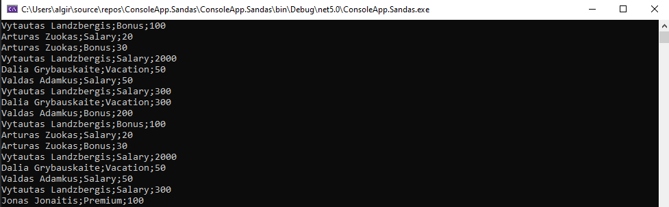
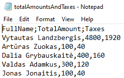
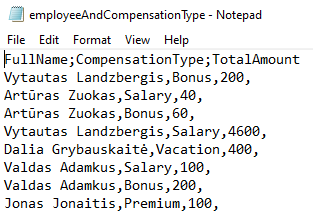

# ConsoleApp.Sandas
Assigments.
Read / Write to CSV and manipulate with data.
Initial Data:

- [x] 1st part of an assigment: - Calculate total amounts off all income and sort by FullName (OrderBy, was not intended)

CSV file:

- [x] 2nd part of an assigment: - GroupBy FullName and CompensationType. Sum all recurring types (example: if Bonus is two times for same Name)

CSV file:

