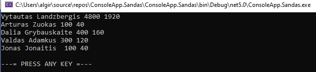
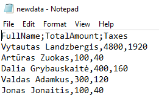

# ConsoleApp.Sandas

- [x] 1st part of an assigment:

Above data in console window succesfully printed to csv file [totalAmountsAndTaxes.csv] 

- [ ] 2nd part of an assigment. (pending WriteToCsv method fix) [ -in progress]
